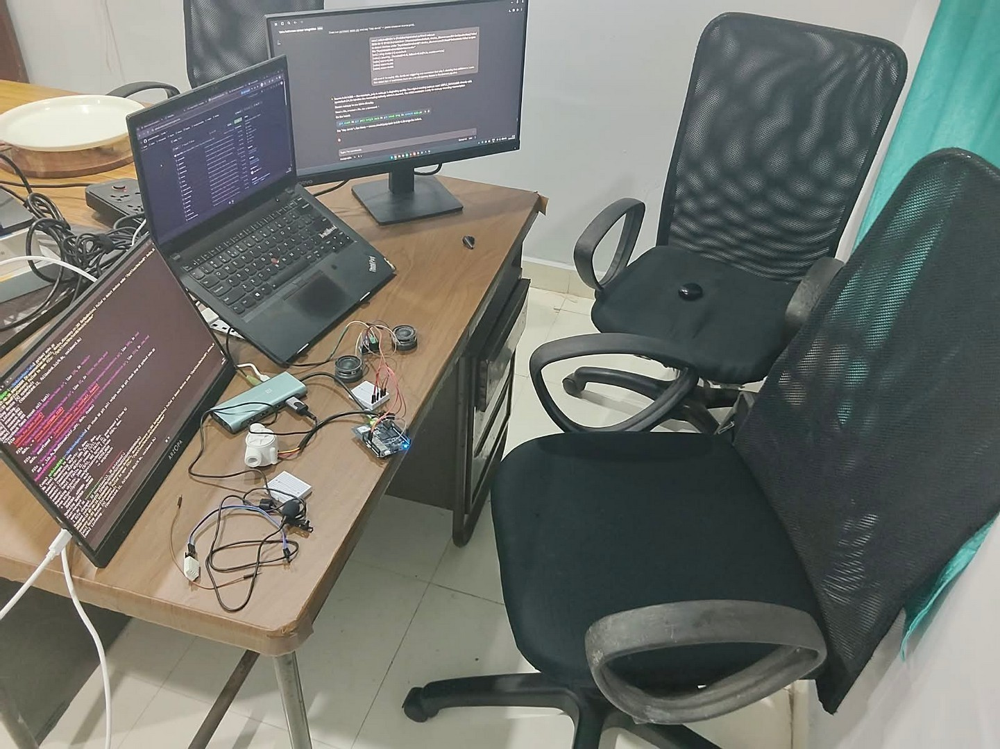
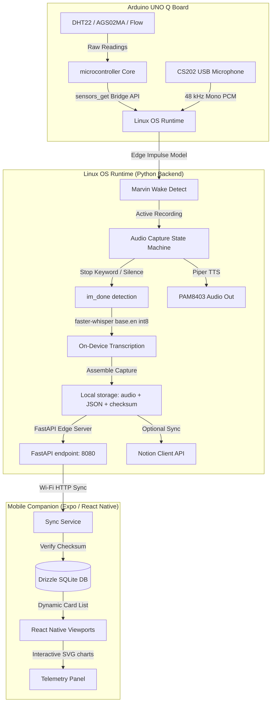
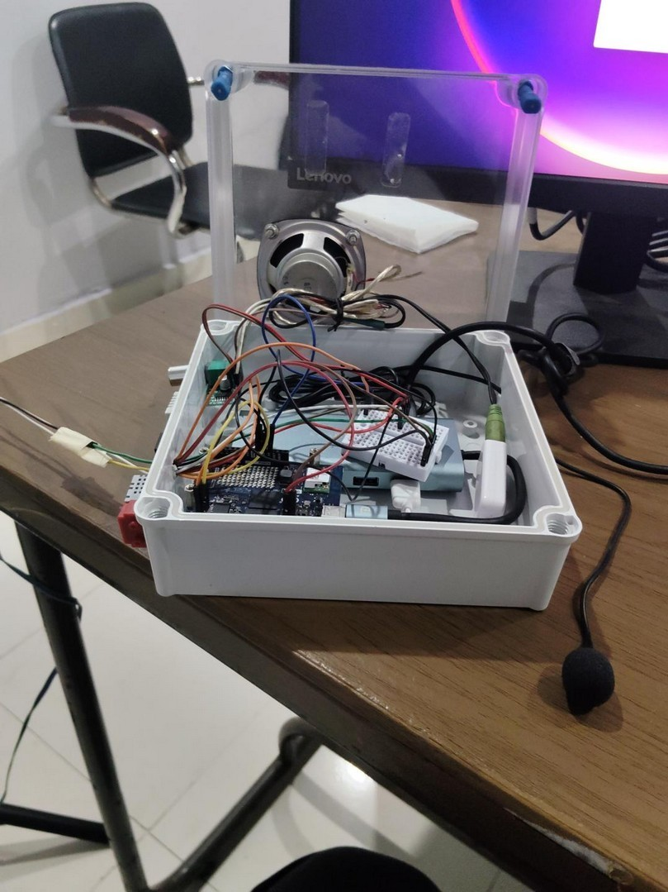
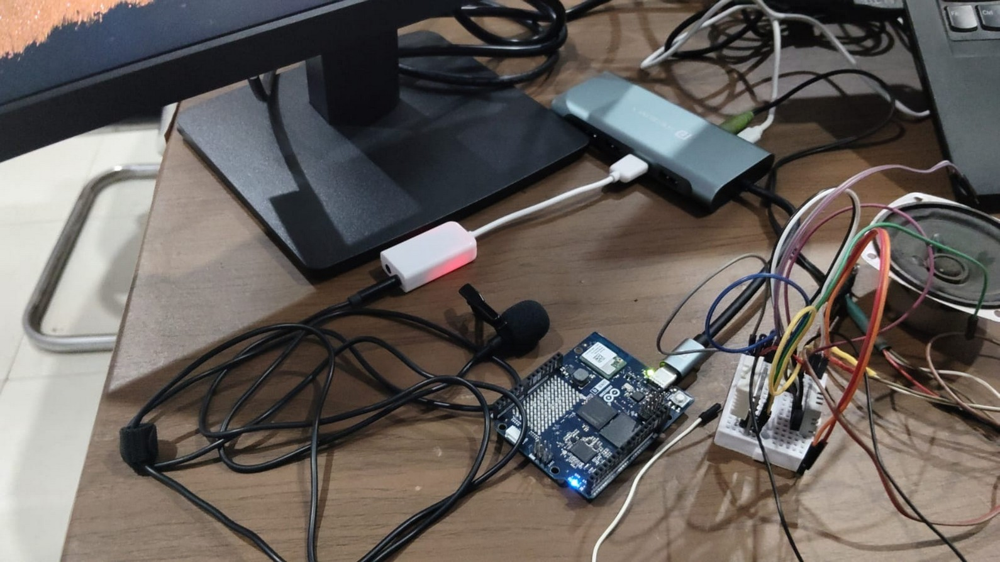
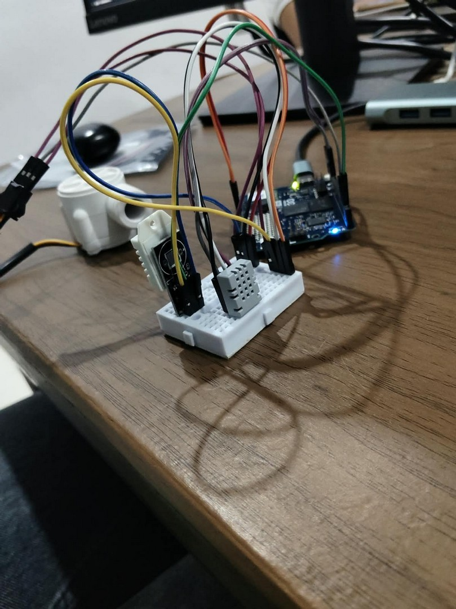

# VAHA — Offline-First Physical AI Voice Capture Device

<div align="center">

**Arduino Physical AI Challenge India 2026 — Project Report & Repository**

*Organized by Robu.in × Arduino*

[](https://www.arduino.cc)
[](https://reactnative.dev)
[](https://www.python.org)
[](https://www.sqlite.org)

**Team ID:** `APC-2026-AP-13507` | **Track:** `Smart Homes / Consumer AI` | **Institution:** `Dharanova, Visakhapatnam, India`

[📺 View Demo Video](https://youtu.be/_Y_hMeHslhI?si=Uxo2WZzAGikBSO-f) • [📱 Download APK](#-mobile-companion-apk) • [🔌 Circuit Pinout](#-hardware-bom--wiring) • [⚙️ Installation](#-setup--installation)

</div>

---

## 📺 Demo Showcase

Click the player card below to watch the physical device voice transcription and telemetry capture demo in action:

<div align="center">
  <a href="https://youtu.be/_Y_hMeHslhI?si=Uxo2WZzAGikBSO-f">
    
  </a>
  <p><em>Demo video link: <a href="https://youtu.be/_Y_hMeHslhI?si=Uxo2WZzAGikBSO-f">https://youtu.be/_Y_hMeHslhI</a></em></p>
</div>

---

## 🌌 Project Overview & Problem Statement

Good ideas don't always arrive when we are ready to write them down. In places like the bathroom or kitchen, we are physically away from our phones while our minds are still active. By the time we leave and try to write the idea down, part of it may already be forgotten. And even when we save it, we lose the physical context around that moment.

**VAHA** solves both problems:
1. **Hands-free capture**: Captures the thought on-the-spot using a physical, offline AI voice logger.
2. **Context Enrichment**: Records the surrounding temperature, humidity, TVOC air quality, and water flow at the exact moment of capture, storing a complete physical snapshot of your environment alongside your thought.

---

## 🏗️ System Workflow & Architecture

The Arduino UNO Q serves as the central bridge, running an on-device Linux OS environment alongside an MCU microcontroller core to merge local voice AI processing with physical sensing.



### Step-by-Step Data Flow:
1. **Wake Word Detection**: The user says *"Marvin"*. The on-device Edge Impulse model (`new-marvin.eim`) detects it and triggers a `capture_started` event over WebSockets.
2. **Audio Capture**: Raw audio is recorded at **48 kHz (16-bit PCM)** with noise reduction.
3. **Stop Trigger**: Recording ends when the stop phrase *"im_done"* is detected (threshold 0.80) or after 10 seconds of silence.
4. **On-Device STT**: Audio is downsampled to 16 kHz and transcribed locally using `faster-whisper` (`base.en`, int8 quantized, running on CPU).
5. **Sensor Sync**: Environmental readings are pulled via the sketch's `sensors_get()` bridge call and packaged into a JSON metadata payload.
6. **Local Storage**: The capture package (`audio.wav`, `transcript.json`, `metadata.json`, `checksum.md5`) is written locally to `captures/YYYY/MM/DD/uuid/` and optionally synced to Notion.
7. **Mobile Sync**: The companion React Native app pulls the captures over local Wi-Fi, verifies the MD5 checksums, inserts records into Drizzle SQLite, and issues a purge command to clear the physical device storage.

---

## 📷 Physical Workspace & Assembly

Here is the physical layout of the VAHA ecosystem during assembly and active testing:

<div align="center">
  <table border="0">
    <tr>
      <td width="50%" align="center">
        <br/>
        <b>Development Workspace Layout</b>
      </td>
      <td width="50%" align="center">
        <br/>
        <b>Assembled Enclosure Interior</b>
      </td>
    </tr>
    <tr>
      <td width="50%" align="center">
        <br/>
        <b>UNO Q, USB Hub & Lavalier Mic Setup</b>
      </td>
      <td width="50%" align="center">
        <br/>
        <b>DHT22 & AGS02MA TVOC Sensor Wiring</b>
      </td>
    </tr>
    <tr>
      <td colspan="2" align="center">
        <br/>
        <b>Water Flow Sensor Test Rig Setup</b>
      </td>
    </tr>
  </table>
</div>

---

## 🔌 Hardware BOM & Wiring

### Bill of Materials (BOM)
*   **Microcontroller**: Arduino UNO Q (ABX00087)
*   **Climate Sensor**: DHT22 Temperature & Humidity Sensor
*   **Air Quality Sensor**: AGS02MA TVOC Air Quality Sensor (I2C)
*   **Water Sensor**: Hall-effect Pulse Water Flow Sensor (7.5 pulses/L/min)
*   **Audio Input**: USB Lavalier Microphone (auto-detected as CS202)
*   **Audio Output**: PAM8403 Audio Amplifier + 4Ω 3W Speaker
*   **Peripherals**: Portronics USB-C multiport hub, 2x Mini Breadboards, Mi-branded Power Bank

### Schematic Diagram
<div align="center">
  
</div>

### Pin Connection Map
| Sensor/Module | Module Pin | Arduino UNO Q Pin | Connection Type | Description |
|:---|:---|:---|:---|:---|
| **DHT22** | VCC | 5V | Power | Temperature & Humidity Sensor |
| **DHT22** | DATA | Pin D2 | Digital Input | Climate telemetry signal line |
| **DHT22** | GND | GND | Ground | Common ground |
| **Water Flow** | VCC | 5V | Power | Hall-effect pulse sensor |
| **Water Flow** | SIG | Pin D3 | Digital Interrupt | RISING edge interrupt pulse counter |
| **Water Flow** | GND | GND | Ground | Common ground |
| **AGS02MA** | VCC | 3.3V | Power | TVOC air quality sensor |
| **AGS02MA** | SDA | Pin A4 (SDA) | I2C Data | Communicates at 20kHz clock |
| **AGS02MA** | SCL | Pin A5 (SCL) | I2C Clock | - |
| **AGS02MA** | GND | GND | Ground | Common ground |
| **PAM8403** | 5V / GND | 5V / GND | Power | Speaker amplifier module |
| **PAM8403** | Audio In | Audio Out (Analog)| Analog Input | Voice prompt TTS output from Uno Q |
| **Speaker** | L+ / L- | Speaker Outputs | Analog Output | 4Ω 3W audio transducer output |

---

## 🤖 AI / ML Model Specifications

| Layer / Task | Model Used | Platform / Runtime | Training & Dataset |
|:---|:---|:---|:---|
| **A: Wake-word Spotting** | `"Marvin"` (`new-marvin.eim`) | Edge Impulse Runner | Trained on 48 custom voice logs augmented into 1,800 sample iterations. |
| **B: Stop-phrase Spotting** | `"im_done"` (`new-marvin.eim`) | Edge Impulse Runner | Trained on custom-recorded voice command datasets. |
| **C: Speech-to-Text (STT)** | `faster-whisper base.en` | CTranslate2 (int8, CPU) | Pretrained English speech model. Unmodified, fully offline on-device. |

---

## 📊 Verification & Performance Results

### Scripted Verification Scenarios:
1. **Normal Offline Capture** (Wake word ➔ Record ➔ Transcribe ➔ Store ➔ Sync ➔ Purge): **SUCCESS**
2. **Transfer Interruption**: Checksum mismatch correctly triggers retries with exponential backoffs: **SUCCESS**
3. **Recovery on Reconnect**: Background sync engine resumes automatically when network goes online: **SUCCESS**
4. **Duplicate-Capture Prevention**: Implemented UUID folder structures and SQLite primary key index constraints: **SUCCESS**

### Performance Metrics:
*   **Sync-Initiation Latency**: ~250 ms average per capture package.
*   **Transfer Throughput**: ~1.5 MB/s over local Wi-Fi (~1 second per MB of audio).
*   **CPU Utilization**: ~30% peak CPU usage on the Arduino UNO Q during local Whisper inference.
*   **WebSocket Telemetry Latency**: <10 ms latency for real-time sensor updates.
*   **Database Write Latency**: ~5 ms per SQLite transaction in the mobile app.

---

## 📱 Mobile Companion APK

The compiled Android companion application is available in the repository:

*   **[📥 Download ARM64 App Build (v1.1.0)](release/vaha-companion-v1.1.0-arm64-v8a.apk)** (Optimized for arm64-v8a)
*   **[📥 Download ARMv7 App Build (v1.1.0)](release/vaha-companion-v1.1.0-armeabi-v7a.apk)** (Optimized for armeabi-v7a)

---

## ⚙️ Setup & Installation

### 1. Microcontroller Firmware Flash
1. Install Arduino CLI or Arduino IDE.
2. Open [`sketch/sketch.ino`](file:///c:/Projects/vaha/sketch/sketch.ino).
3. Install dependencies: `DHT` library and `Arduino_RouterBridge` library.
4. Upload the sketch to the **Arduino UNO Q** board.

### 2. Python Backend Edge Runtime
1. Install **Python 3.12** on the Uno Q Linux workspace.
2. Navigate to [`python/`](file:///c:/Projects/vaha/python):
   ```bash
   cd python
   python -m venv venv
   # Activate:
   .\venv\Scripts\activate  # Windows
   source venv/bin/activate # Linux/macOS
   ```
3. Install dependencies:
   ```bash
   pip install -r requirements.txt
   ```
4. Copy `.env.example` to `.env` and fill in API keys (Notion database IDs, Groq token for fallback).
5. Start the edge server:
   ```bash
   python main.py
   ```

### 3. Mobile Companion Application (React Native)
1. Install Node.js (LTS version).
2. Navigate to [`mobile/`](file:///c:/Projects/vaha/mobile):
   ```bash
   cd mobile
   npm install
   ```
3. Run the development server:
   ```bash
   npx expo start
   ```

---

## 📄 License & Intellectual Property
Proprietary. All rights reserved. Code licensed under custom terms for **Gratian Technologies**.
