# VAHA — Offline-First Physical AI Voice Capture Device

<div align="center">

**Arduino Physical AI Challenge India 2026 — Project Report & Repository**

*Organised by Robu.in × Arduino*

[](https://www.arduino.cc)
[](https://reactnative.dev)
[](https://www.python.org)
[](https://www.sqlite.org)

**Team Name:** `VAHA` | **Team ID:** `APC-2026-AP-13507` | **Track:** `Smart Homes / Consumer AI`  
**Institution:** `Dharanova Pvt Ltd, Visakhapatnam, Andhra Pradesh, India`  
**Developer:** `Ritesh Bonthalakoti (ritesh@dharanova.com)` — Solo Developer

[📄 View Final Project Report PDF](docs/VAHA%20Report.pdf) • [📺 View Demo Video](https://youtu.be/_Y_hMeHslhI?si=Uxo2WZzAGikBSO-f) • [📱 Download APK](#-mobile-companion-apk)

</div>

---

## 📺 Demo & Product Showcase

<div align="center">
  <table border="0">
    <tr>
      <td width="50%" align="center">
        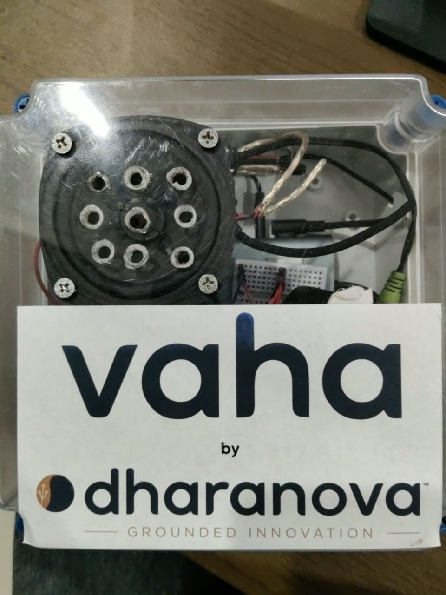<br/>
        <b>1. VAHA Hardware Product — by Dharanova Pvt Ltd</b>
      </td>
      <td width="50%" align="center">
        <br/>
        <b>2. Companion App — Home Dashboard</b>
      </td>
    </tr>
  </table>
  <br/>
  
  <a href="https://youtu.be/_Y_hMeHslhI?si=Uxo2WZzAGikBSO-f">
    
  </a>
  <p><em>📺 Click above or visit <a href="https://youtu.be/_Y_hMeHslhI?si=Uxo2WZzAGikBSO-f">https://youtu.be/_Y_hMeHslhI</a> to watch the full physical demonstration.</em></p>
</div>

---

## ⏳ Project Development Timeline

<div align="center">
  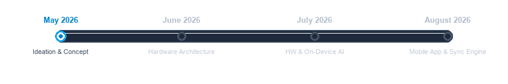
</div>

---

## 🌌 Project Overview & Problem Statement

Creative minds don't switch off. Ideas show up at the office, school, the park, a beach, in transit — anywhere you'd normally have a phone or notebook close by. There's one place that isn't true: **the bathroom**, where the mind keeps wandering with no way to write anything down. **VAHA** closes that gap — built for the one place your other devices can't follow you, so an idea never has to wait.

### Key Innovations:
1. **Hands-free Voice Capture**: Say *"Marvin"* to start recording thoughts without touching a phone or unlocking a device.
2. **Environmental Context Enrichment**: Stamps every voice note with temperature, humidity, TVOC air quality, and water flow rate at that exact moment.
3. **100% On-Device & Offline Privacy**: All wake-word detection, speech-to-text, sensor processing, and storage run locally on the Arduino UNO Q. No audio or text ever touches the cloud.

---

## 🏗️ System Workflow & Architecture

The Arduino UNO Q serves as the central bridge, running an on-device Linux OS environment alongside an MCU microcontroller core to merge local voice AI processing with physical sensing.

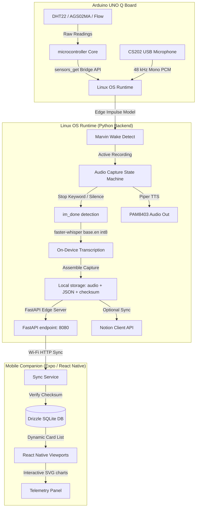

### Step-by-Step Data Flow:
1. **Wake Word Detection**: The user says *"Marvin"*. The on-device Edge Impulse model (`new-marvin.eim`) detects it and triggers a `capture_started` event over WebSockets.
2. **Audio Capture**: Raw audio is recorded at **48 kHz (16-bit PCM)** with noise reduction.
3. **Stop Trigger**: Recording ends when the stop phrase *"im_done"* is detected (threshold 0.80) or after 10 seconds of silence.
4. **On-Device STT**: Audio is downsampled to 16 kHz and transcribed locally using `faster-whisper` (`base.en`, int8 quantized, running on CPU).
5. **Sensor Sync**: Environmental readings are pulled via the sketch's `sensors_get()` bridge call and packaged into a JSON metadata payload.
6. **Local Storage**: The capture package (`audio.wav`, `transcript.json`, `metadata.json`, `checksum.md5`) is written locally to `captures/YYYY/MM/DD/uuid/` and optionally synced to Notion.
7. **Mobile Sync**: The companion React Native app pulls the captures over local Wi-Fi, verifies the MD5 checksums, inserts records into Drizzle SQLite, and issues a purge command to clear the physical device storage.

---

## 📐 System Block & Circuit Diagrams

### Figure 1. VAHA System Block Diagram
<div align="center">
  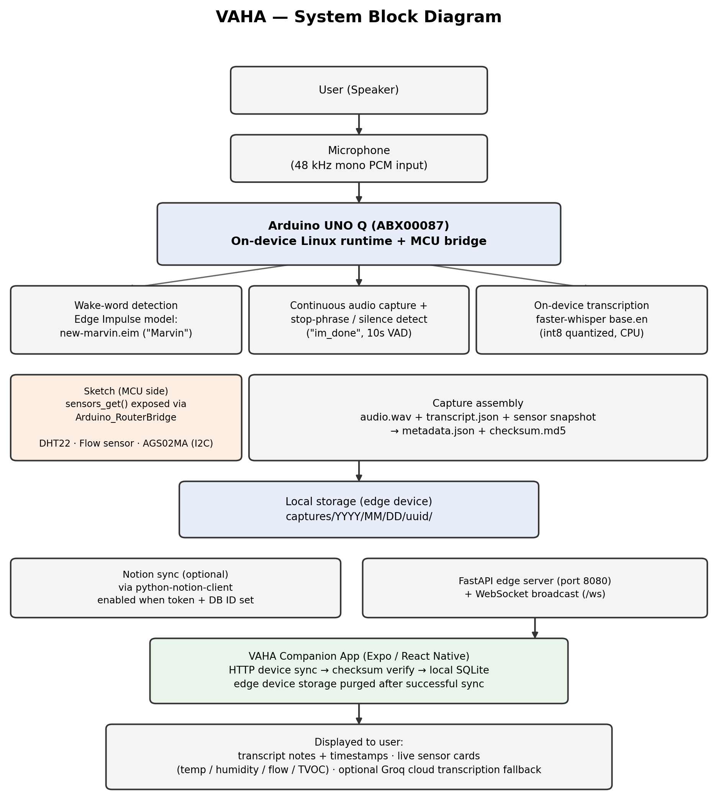
</div>

<br/>

### Figure 2. VAHA Main Circuit Schematic
<div align="center">
  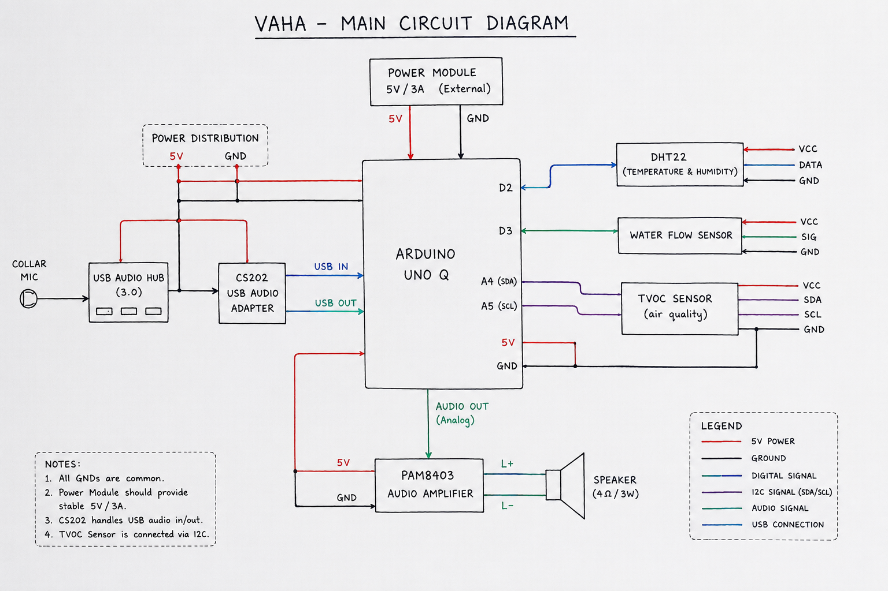
</div>

---

## 📷 Complete Project Image Gallery

### 📱 Mobile Companion Application Views
<div align="center">
  <table border="0">
    <tr>
      <td width="25%" align="center">
        <br/>
        <b>Home View — Synced Notes</b>
      </td>
      <td width="25%" align="center">
        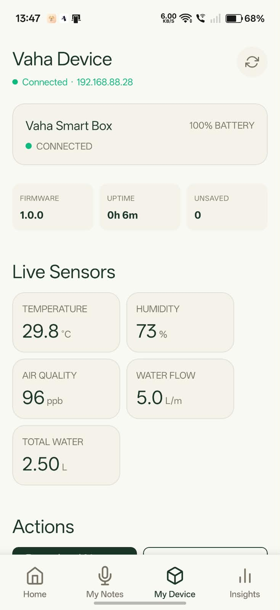<br/>
        <b>Device View — Live Telemetry</b>
      </td>
      <td width="25%" align="center">
        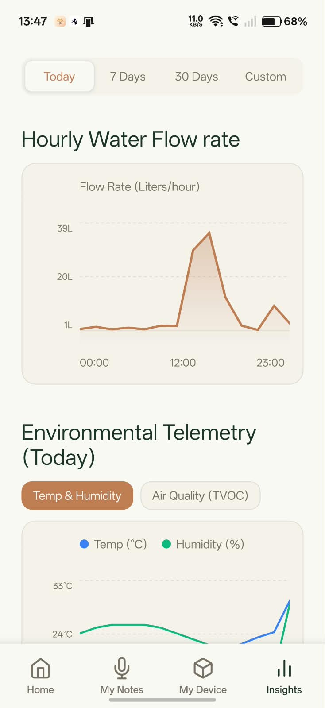<br/>
        <b>Insights View — Trends</b>
      </td>
      <td width="25%" align="center">
        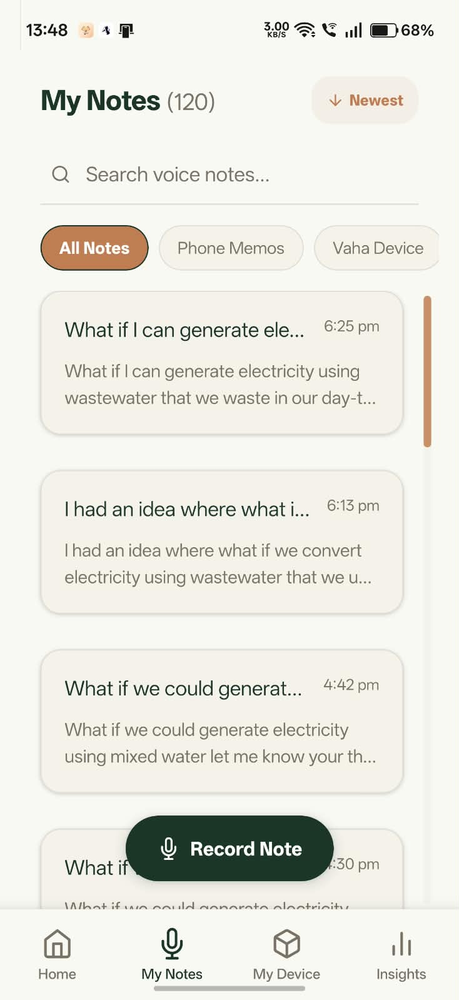<br/>
        <b>Notes View — Searchable Logs</b>
      </td>
    </tr>
  </table>
</div>

<br/>

### 🛠️ Hardware Build & Sensor Test Rigs
<div align="center">
  <table border="0">
    <tr>
      <td width="50%" align="center">
        <br/>
        <b>Development Workspace & Assembly Layout</b>
      </td>
      <td width="50%" align="center">
        <br/>
        <b>Arduino UNO Q & Microphone Setup</b>
      </td>
    </tr>
    <tr>
      <td width="50%" align="center">
        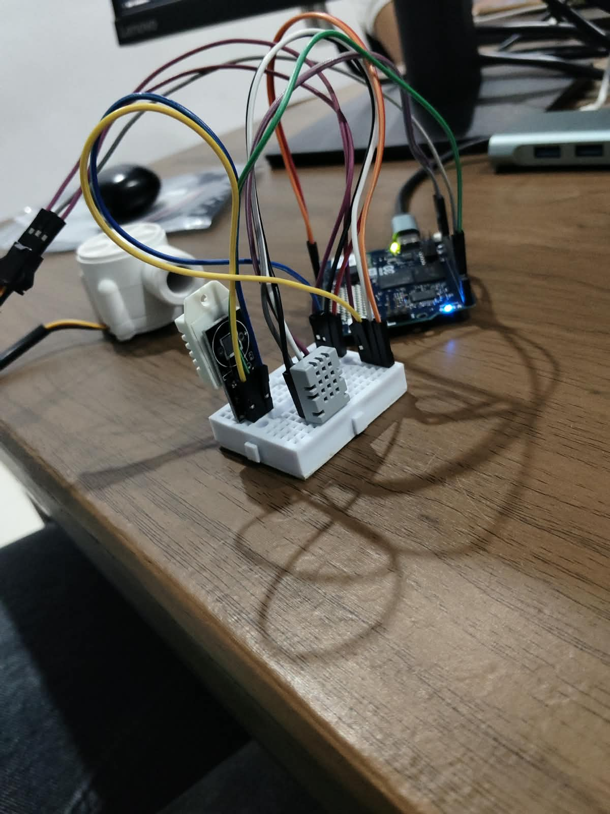<br/>
        <b>DHT22 & AGS02MA TVOC Sensor Wiring</b>
      </td>
      <td width="50%" align="center">
        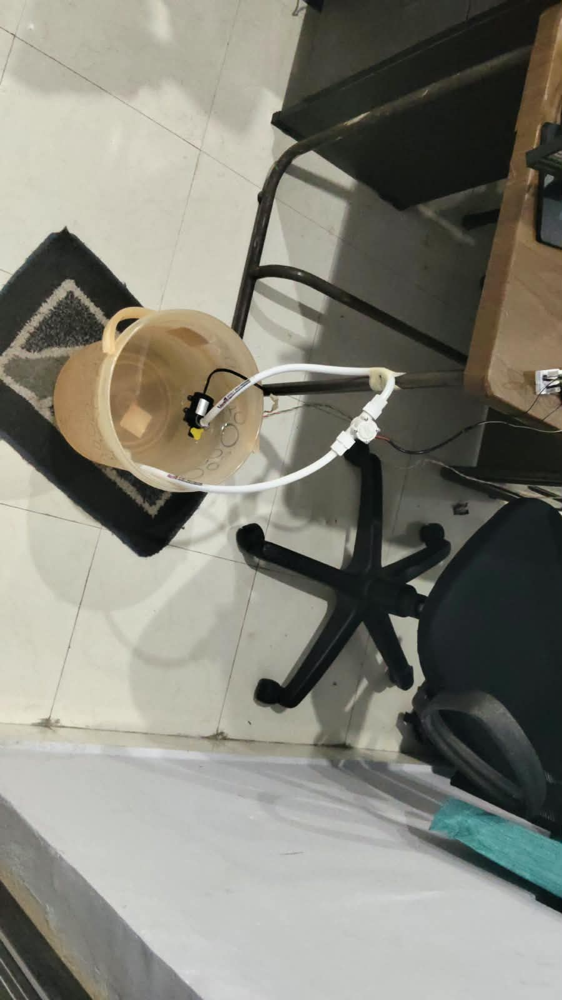<br/>
        <b>Water Flow Sensor In-Line Testing</b>
      </td>
    </tr>
    <tr>
      <td width="50%" align="center">
        <br/>
        <b>Hardware Components Suite</b>
      </td>
      <td width="50%" align="center">
        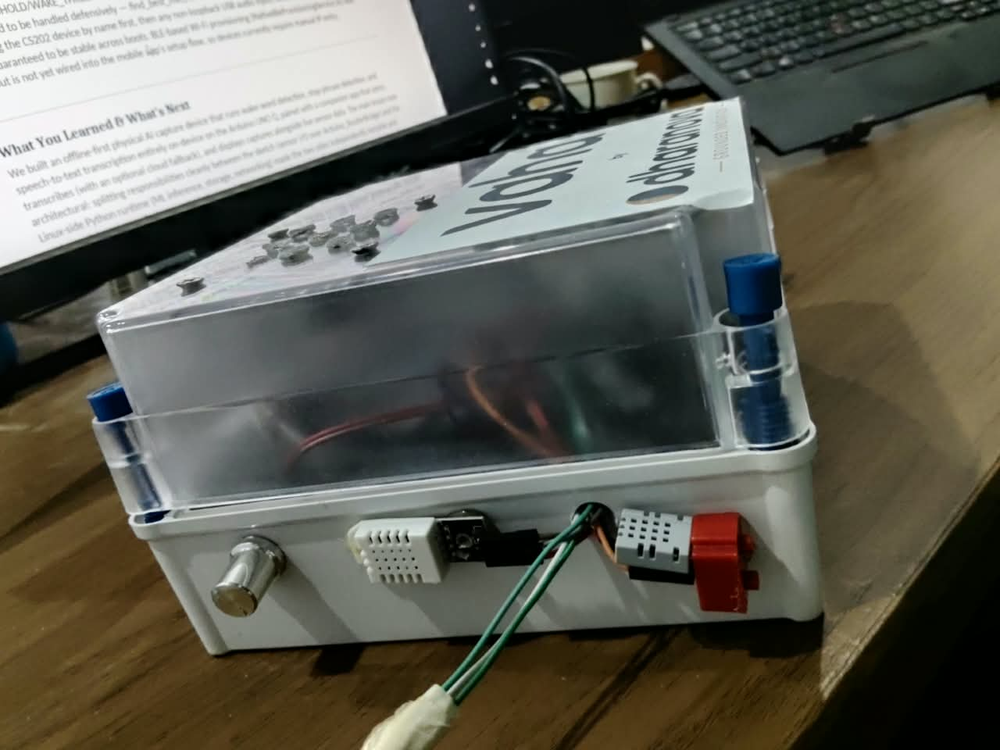<br/>
        <b>Enclosed VAHA Device Sensor Port</b>
      </td>
    </tr>
  </table>
</div>

---

## 🔌 Hardware BOM & Wiring

### Bill of Materials (BOM)
*   **Microcontroller**: Arduino UNO Q (ABX00087) — 4GB RAM / 32GB storage
*   **Climate Sensor**: DHT22 Temperature & Humidity Sensor
*   **Air Quality Sensor**: AGS02MA TVOC Air Quality Sensor (I2C)
*   **Water Sensor**: Hall-effect Pulse Water Flow Sensor (7.5 pulses/L/min)
*   **Audio Input**: USB Lavalier Microphone (auto-detected via CS202 adapter)
*   **Audio Output**: PAM8403 Audio Amplifier + 4Ω 3W Speaker (chime + Piper TTS output)
*   **Peripherals**: Portronics USB-C multiport hub, 2x Mini Breadboards, 10000 mAh Power Bank

### Pin Connection Map
| Sensor/Module | Module Pin | Arduino UNO Q Pin | Connection Type | Description |
|:---|:---|:---|:---|:---|
| **DHT22** | VCC | 5V | Power | Temperature & Humidity Sensor |
| **DHT22** | DATA | Pin D2 | Digital Input | Climate telemetry signal line |
| **DHT22** | GND | GND | Ground | Common ground |
| **Water Flow** | VCC | 5V | Power | Hall-effect pulse sensor |
| **Water Flow** | SIG | Pin D3 | Digital Interrupt | RISING edge interrupt pulse counter |
| **Water Flow** | GND | GND | Ground | Common ground |
| **AGS02MA** | VCC | 3.3V | Power | TVOC air quality sensor |
| **AGS02MA** | SDA | Pin A4 (SDA) | I2C Data | Communicates at 20kHz clock |
| **AGS02MA** | SCL | Pin A5 (SCL) | I2C Clock | - |
| **AGS02MA** | GND | GND | Ground | Common ground |
| **PAM8403** | 5V / GND | 5V / GND | Power | Speaker amplifier module |
| **PAM8403** | Audio In | Audio Out (Analog)| Analog Input | Voice prompt TTS output from Uno Q |
| **Speaker** | L+ / L- | Speaker Outputs | Analog Output | 4Ω 3W audio transducer output |

---

## 🤖 AI / ML Model Specifications

| Layer / Task | Model Used | Platform / Runtime | Training & Dataset |
|:---|:---|:---|:---|
| **A: Wake-word Spotting** | `"Marvin"` (`new-marvin.eim`) | Edge Impulse Runner | Trained on 48 custom voice logs augmented into 1,800 sample iterations (98.7% accuracy). |
| **B: Stop-phrase Spotting** | `"im_done"` (`new-marvin.eim`) | Edge Impulse Runner | Trained on custom-recorded voice command datasets. |
| **C: Speech-to-Text (STT)** | `faster-whisper small` (277M) | CTranslate2 (int8, CPU) | Fine-tuned English speech model running 100% offline on-device. |

---

## 📊 Verification & Real Bathroom Noise Results

### Testing Highlights:
- **Verified under real bathroom noise — 34 capture trials**: Wake word and stop phrase were exercised across 34 capture attempts in an actual bathroom environment with the exhaust fan running and the tap open. Detection held reliably throughout at `0.75 / 0.80` thresholds.
- **End-to-end flow verified**: Wake word ➔ Recording ➔ Stop phrase / VAD cutoff ➔ On-device transcription ➔ Local SQLite save ➔ Mobile sync.
- **Checksum Verification**: Confirmed on every capture package synced to the companion app with zero corrupted transfers.

### Performance Metrics:
*   **Sync-Initiation Latency**: ~250 ms average per capture package.
*   **Transfer Throughput**: ~1.5 MB/s over local Wi-Fi.
*   **CPU Utilization**: ~30% peak CPU usage on the Arduino UNO Q during local Whisper inference.
*   **WebSocket Telemetry Latency**: <10 ms latency for real-time sensor updates.
*   **Database Write Latency**: ~5 ms per SQLite transaction in the mobile app.

---

## 📱 Mobile Companion APK

The compiled Android companion application is available in the repository:

*   **[📥 Download ARM64 App Build (v1.1.0)](release/vaha-companion-v1.1.0-arm64-v8a.apk)** (Optimized for arm64-v8a)
*   **[📥 Download ARMv7 App Build (v1.1.0)](release/vaha-companion-v1.1.0-armeabi-v7a.apk)** (Optimized for armeabi-v7a)

---

## ⚙️ Setup & Installation

### 1. Microcontroller Firmware Flash
1. Install Arduino CLI or Arduino IDE.
2. Open [`sketch/sketch.ino`](file:///c:/Projects/vaha/sketch/sketch.ino).
3. Install dependencies: `DHT` library and `Arduino_RouterBridge` library.
4. Upload the sketch to the **Arduino UNO Q** board.

### 2. Python Backend Edge Runtime
1. Install **Python 3.12** on the Uno Q Linux workspace.
2. Navigate to [`python/`](file:///c:/Projects/vaha/python):
   ```bash
   cd python
   python -m venv venv
   # Activate:
   .\venv\Scripts\activate  # Windows
   source venv/bin/activate # Linux/macOS
   ```
3. Install dependencies:
   ```bash
   pip install -r requirements.txt
   ```
4. Copy `.env.example` to `.env` and fill in API keys (Notion database IDs, Groq token for fallback).
5. Start the edge server:
   ```bash
   python main.py
   ```

### 3. Mobile Companion Application (React Native)
1. Install Node.js (LTS version).
2. Navigate to [`mobile/`](file:///c:/Projects/vaha/mobile):
   ```bash
   cd mobile
   npm install
   ```
3. Run the development server:
   ```bash
   npx expo start
   ```

---

## 📄 License & Intellectual Property

Proprietary. All rights reserved. Code licensed under custom terms for **Dharanova Private Limited**.
