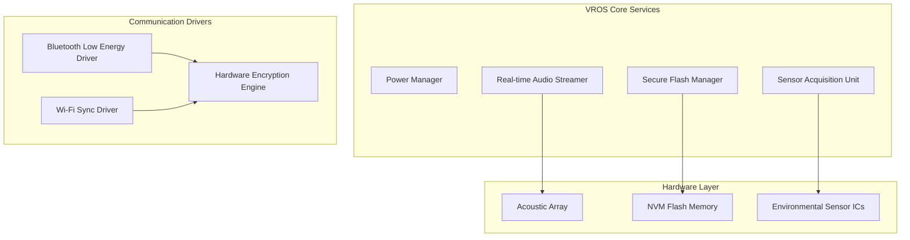

# VROS (Vaha Real-time Operating System) Specification

VROS is the custom, embedded operating system developed specifically for the Vaha physical capture hardware. It is designed for low power consumption, real-time audio buffering, secure local storage, and background synchronization.

---

## 1. Operating System Architecture

VROS utilizes a microkernel or lightweight real-time kernel architecture to ensure predictable execution times, fast boot cycles, and advanced power-saving states.

---

## 2. Key OS Subsystems

### 2.1 Real-time Audio Streamer
*   **Standby Monitoring**: Continuously monitors the incoming acoustic stream in a low-power ring buffer.
*   **Wake Word Processor**: Runs local, hardware-accelerated classification algorithms to identify the activation word.
*   **Secure Capture Buffer**: Allocates dedicated heap memory to record and buffer spoken audio immediately post-wake.

### 2.2 Sensor Acquisition Unit
*   **Periodic Sampling**: Queries physical climate and volatile gas sensors at regular intervals and upon voice triggers.
*   **Flow Telemetry Interruption**: Manages high-priority interrupts from liquid flow sensors to track rate and total volume metrics in real-time.

### 2.3 Secure Flash Manager
*   **Journaled File System**: Writes voice captures and paired telemetry packets to non-volatile flash using a custom, power-loss-resilient file system.
*   **Encrypted Storage**: Encrypts data blocks at rest using hardware-accelerated AES-256 before writing to flash.

### 2.4 Power Manager
*   **Deep Sleep**: Disables RF modules, sensors, and primary compute cores during standby.
*   **Acoustic Wakeup**: Transitions from deep sleep to active mode upon wake-word recognition or BLE advertising triggers.

---

## 3. Firmware Update (OTA) Architecture

VROS guarantees system security and integrity through a dual-partition bootloader system (A/B partitioning):
1.  **Passive Update**: Firmware images are downloaded in the background by the Sync Driver and verified for cryptographic signatures.
2.  **A/B Partition Switch**: Upon validation, the bootloader toggles the active boot partition.
3.  **Automatic Fallback**: If boot fails, the device reverts automatically to the stable golden image on the backup partition.
