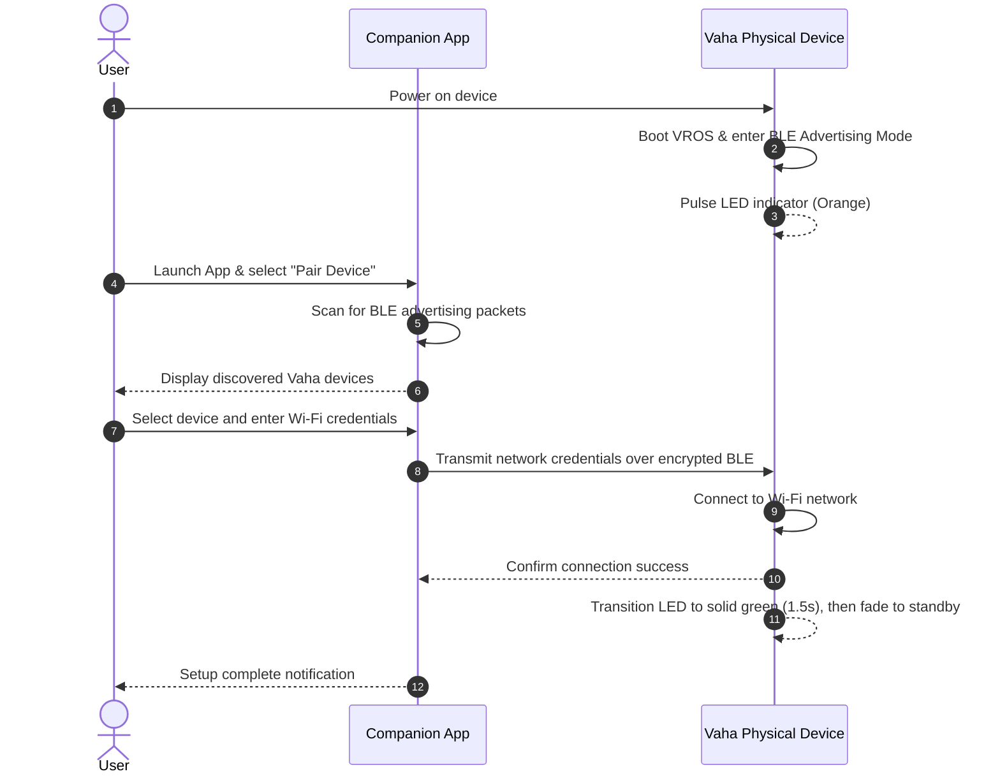
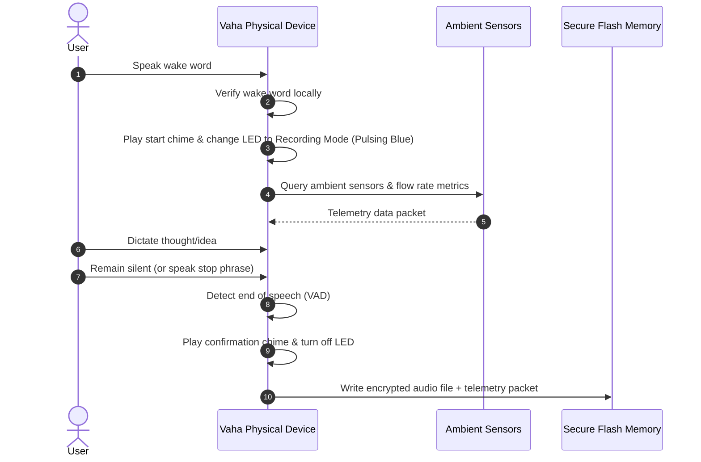
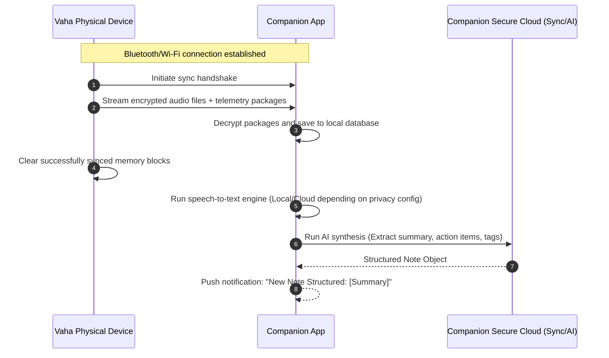

# Vaha User Flows & Interaction Journeys

This document details the core user journeys across the Vaha hardware device and the companion application.

---

## 1. Out-of-Box Setup & Pairing Flow

This journey details how a user configures a new physical device and pairs it with their companion app.

---

## 2. Voice Capture & Telemetry Recording Flow

The core capture loop, operating entirely on-device and offline.

---

## 3. Background Sync & Companion App Processing Flow

The background sequence that transfers, transcribes, and enriches captured notes.

