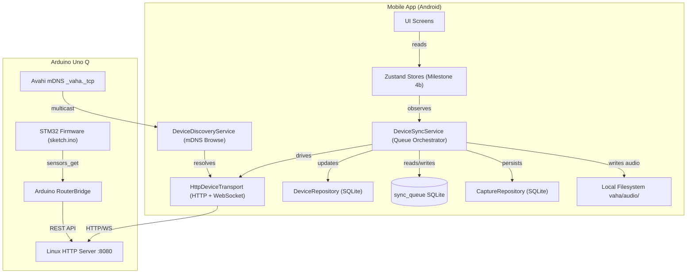

# VAHA Communication Architecture
## Phase D — Architectural Review Document

**Status:** DRAFT — Pending Review  
**Author:** Lead Systems Architect  
**Date:** 2026-07-20  
**Version:** 1.0.0

---

## Overview

This document defines the production-quality communication architecture between the **Arduino Uno Q** (running Linux + STM32, exposed via `Arduino_RouterBridge`) and the **Expo mobile companion application** (Android-first, React Native / TypeScript).

The system must honour VAHA's core tenets:

- **Offline-first:** The device captures and stores data without network; the app consumes it when connectivity is available.
- **Privacy-first:** No audio or personal data ever transits through a third-party server.
- **Zero-UI-in-this-phase:** This document covers infrastructure only. No UI code is written until architecture is approved.

---

## 1. Device Discovery

### Question
How does the mobile app find the physical device on the local network without manual IP entry?

### Decision: mDNS (Multicast DNS / Zeroconf)

The Arduino Uno Q Linux layer advertises a service record over mDNS using Avahi (the standard Linux mDNS daemon). The mobile app performs service discovery using `react-native-zeroconf` (to be evaluated — see Open Questions).

**Advertised service record:**
```
Service type:  _vaha._tcp
Instance name: VAHA-<device-uuid>
Port:          8080
TXT records:
  fw=<firmware-version>
  model=unoq
  api=v1
```

**Discovery flow:**
```
[Mobile App]                          [Device - Linux]
     |                                       |
     |── Browse _vaha._tcp ─────────────────>|
     |<─ Service announce (IP, port, TXT) ───|
     |── TCP connect to resolved IP:8080 ───>|
     |<─ HTTP/WebSocket established ─────────|
```

**Fallback:** If mDNS is blocked (some enterprise Wi-Fi), the user can manually enter IP in Device Setup screen (Milestone 6B.4 UI — not yet implemented).

**Rationale:** mDNS is zero-configuration, requires no cloud relay, and is natively supported on iOS and Android. It aligns with offline-first principles.

---

## 2. Transport Protocol

### Question
What protocol governs data transfer between the device and the mobile app?

### Decision: HTTP/1.1 REST for command-response + WebSocket for real-time streaming

The communication layer uses **two transport modes**, selected based on interaction type:

| Mode | Protocol | Use Case |
|------|----------|----------|
| Command-Response | HTTP/1.1 REST | Status polling, handshake, note listing, file metadata |
| Real-time Stream | WebSocket | Live audio streaming, sensor telemetry, progress updates |

**Why not HTTP/2 or HTTP/3?**
The Arduino Uno Q Linux environment (arduino:zephyr:unoq) has constrained networking libraries. HTTP/1.1 with Connection: keep-alive is the most stable baseline. WebSocket upgrade over HTTP/1.1 is well-supported.

**Why not BLE-only?**
BLE throughput (~1-3 Mbps practical) is insufficient for FLAC audio payloads. Wi-Fi is the primary sync transport. BLE is reserved for pairing and low-bandwidth status beacons (Milestone 7).

**Transport abstraction:** The mobile app wraps all network calls behind a `DeviceTransport` interface so the underlying protocol (HTTP, WebSocket, or BLE) can be swapped without touching business logic.

```typescript
interface DeviceTransport {
  get<T>(path: string): Promise<Result<T, CommunicationError>>;
  post<T, B>(path: string, body: B): Promise<Result<T, CommunicationError>>;
  openStream(path: string, onMessage: (msg: DeviceMessage) => void): DeviceStream;
  close(): Promise<void>;
}
```

---

## 3. Device-Side HTTP Server

### Question
What does the device expose, and how is it structured?

### Decision: Lightweight HTTP server on the Linux layer, bridged to STM32 via Arduino_RouterBridge

The Arduino Uno Q exposes a minimal HTTP server on the Linux side. The firmware STM32 side exposes sensor data via `Bridge.provide("sensors_get", ...)` — this is already implemented in `sketch.ino`.

**Base URL:** `http://<device-ip>:8080/api/v1`

**Endpoints:**

| Method | Path | Description |
|--------|------|-------------|
| `GET` | `/status` | Device handshake — returns health, firmware, battery, buffer stats |
| `GET` | `/captures` | List buffered capture metadata (no audio payload) |
| `GET` | `/captures/:txId` | Download single capture payload (audio + telemetry) |
| `DELETE` | `/captures/:txId` | Mark capture as transferred and purge from flash |
| `GET` | `/sensors/current` | Current live sensor reading (calls sensors_get bridge) |
| `GET` | `/ws` | WebSocket upgrade endpoint for real-time telemetry streaming |

---

## 4. Authentication and Session Security

### Question
How does the app authenticate with the device? How is a new device trusted?

### Decision: Pre-shared token derived during BLE pairing, verified on every HTTP request

**Pairing (Milestone 7 — BLE):**
1. User initiates "Add Device" in the app.
2. Device advertises over BLE with a short-lived 6-digit PIN.
3. App connects over BLE, user enters PIN.
4. App and device exchange a 32-byte random shared secret over BLE (ECDH key exchange).
5. The shared secret is stored in:
   - **App side:** Native Secure Keystore (via `expo-secure-store`)
   - **Device side:** Secure flash partition (AES-256 encrypted)

**Token derivation:**
```
session_token = HMAC-SHA256(shared_secret, device_uuid + timestamp_floor_5min)
```
Tokens rotate every 5 minutes to prevent replay attacks without requiring full re-authentication.

**HTTP authentication:**
Every request carries:
```
Authorization: Bearer <session_token>
X-Device-UUID: <device-uuid>
```

**Phase D scope:** For Phase D (before BLE pairing is built), development will use a **static development token** stored in `.env`. This is explicitly flagged as a temporary measure and must be replaced before any production build.

> [!CAUTION]
> The static development token MUST NEVER appear in a production binary. A CI gate must enforce this before any release build.

---

## 5. Protocol Versioning

### Question
How do we handle API version mismatches between device firmware and app versions?

### Decision: URL-prefixed versioning + capability negotiation on handshake

**URL versioning:** All endpoints are prefixed with `/api/v1`. Future breaking changes bump to `/api/v2`. Non-breaking additions are additive to the existing version.

**Capability negotiation:** The `/status` handshake response includes a `capabilities` array:

```json
{
  "device_id": "VAHA-88291-A",
  "firmware_version": "1.0.4",
  "api_version": "v1",
  "capabilities": ["sensors", "audio_flac", "ota"],
  "battery_percentage": 94,
  "buffered_captures_count": 12,
  "storage_used_bytes": 18291000
}
```

The mobile app checks `api_version` against a `MINIMUM_SUPPORTED_API_VERSION` constant. If the device is too old, the app shows a firmware update prompt (not a crash).

**Compatibility constant location:** `src/features/devices/constants/ApiCompatibility.ts` (to be created).

---

## 6. Error Handling and Resilience

### Question
How does the system handle network failures, partial transfers, and device disconnections?

### Decision: Idempotent operations + local sync queue + exponential backoff

**Idempotency:** Every capture transfer uses the `transaction_id` from the device as an idempotency key. If the transfer is interrupted and retried, both the device and app use this ID to detect duplicates.

**Transfer resume:** Large audio payloads use HTTP range requests (`Range: bytes=X-Y`) so interrupted downloads resume from where they stopped.

**Local sync queue:** The existing `sync_queue` table in SQLite already models this. A `DeviceSyncService` will:
1. Enqueue capture transfer jobs with `status: "pending"`.
2. Attempt transfer with retry using exponential backoff (1s, 2s, 4s, 8s, max 60s).
3. Mark jobs `completed` on success, `failed` after max retries.
4. Emit events consumed by Zustand stores (Milestone 4b) for UI status updates.

**Disconnection detection:** The WebSocket connection sends a heartbeat PING every 10 seconds. If 3 consecutive PINGs are missed, the transport layer raises a `DeviceDisconnectedError` and transitions the device status to `offline`.

---

## 7. Data Payload Format

### Question
What serialization format is used for communication? Binary or JSON?

### Decision: JSON for metadata/control, binary multipart for audio payloads

**Control messages (JSON):** All status, metadata, and telemetry messages use JSON. This aligns with the existing API spec in `docs/00-core/06_API_SPEC.md`.

**Audio payloads (binary multipart):** Audio files are transferred as binary streams using `multipart/form-data`. This avoids the ~33% overhead of base64 encoding (the existing spec uses `payload_base64` which is acceptable for small payloads but not FLAC files).

**Revised Note Transfer Payload (Phase D):**
```
POST /api/v1/captures/:txId/transfer
Content-Type: multipart/form-data; boundary=----VahaBoundary

------VahaBoundary
Content-Disposition: form-data; name="metadata"
Content-Type: application/json

{
  "transaction_id": "tx-99201-abc",
  "captured_timestamp": "2026-07-16T08:22:00Z",
  "audio_encoding": "FLAC",
  "sample_rate": 48000,
  "channels": 1,
  "telemetry_metrics": { ... }
}

------VahaBoundary
Content-Disposition: form-data; name="audio"; filename="tx-99201-abc.flac"
Content-Type: audio/flac

<binary FLAC data>
------VahaBoundary--
```

---

## 8. Mobile-Side Architecture

### Question
How is the communication layer organized within the existing mobile codebase?

### Decision: Feature-first service layer under src/features/devices/, injected via DI container

```
src/
  features/
    devices/
      repositories/
        DeviceRepository.ts           ← existing (persists device records)
        DeviceRepositoryImpl.ts       ← existing
      services/
        DeviceDiscoveryService.ts     ← NEW: mDNS scanning, device resolution
        DeviceSyncService.ts          ← NEW: orchestrates sync jobs from queue
      transport/
        DeviceTransport.ts            ← NEW: interface (abstract)
        HttpDeviceTransport.ts        ← NEW: HTTP/WS concrete implementation
        DeviceTransportFactory.ts     ← NEW: creates transport by device config
      models/
        DeviceStatus.ts               ← NEW: typed status payload
        CaptureTransferJob.ts         ← NEW: transfer job model
      constants/
        ApiCompatibility.ts           ← NEW: version constants
  core/
    errors/
      CommunicationError.ts           ← NEW: typed error class
```

**DI registration:** `DeviceDiscoveryService` and `DeviceSyncService` will be registered in the bootstrap pipeline as a new step: `Initialize Device Communication`.

**Boundary rule (enforced):**
- UI → Zustand → Services → Repository interfaces → DB
- UI → Zustand → Services → DeviceTransport → HTTP/WebSocket

No UI component ever calls `DeviceTransport` directly.

---

## 9. Background Sync Behaviour

### Question
Does sync run in the background when the app is not in the foreground?

### Decision: Foreground-only sync in Phase D; background via Headless JS in a future milestone

**Phase D (foreground-only):** Sync is triggered when:
1. The app comes to the foreground (`AppState` change to `active`).
2. The device discovery service resolves a known device on the network.
3. The user manually triggers sync from the Device screen.

**Why not background now?**
- Android background network access requires `FOREGROUND_SERVICE` or `WorkManager` integration (`expo-task-manager` + `expo-background-fetch`).
- This adds significant complexity beyond Phase D scope.
- The use case (voice capture device on the same local Wi-Fi) strongly favors foreground, intentional sync over ambient background polling.

**Future milestone:** Background sync via `expo-background-fetch` with 15-minute minimum interval, restricted to Wi-Fi and charging conditions.

---

## 10. Logging and Observability

### Question
How do we observe the communication layer? (No cloud telemetry allowed)

### Decision: Local structured logging via existing ConsoleLogger, tagged with [COMM] namespace

All communication events use the existing `ConsoleLogger` registered in the bootstrap pipeline:

```
[INFO] [COMM] Device discovered: VAHA-88291-A at 192.168.1.45:8080
[INFO] [COMM] Sync started: 12 pending captures
[WARN] [COMM] Transfer tx-99201-abc retrying (attempt 2/5)
[ERROR] [COMM] Device disconnected unexpectedly: DeviceDisconnectedError
```

**Diagnostic dump (future):** A `DiagnosticsService` will collect last N log entries into a local JSON file users can optionally share with support. No automatic reporting.

---

## 11. Data Integrity

### Question
How does the app ensure captured data integrity after transfer?

### Decision: MD5 checksum verification + idempotent write-and-confirm protocol

**Transfer verification:**
1. Device sends `Content-MD5: <base64-md5>` header with every audio payload.
2. App computes MD5 of received bytes before writing to disk.
3. If checksums match → write to filesystem → insert `Capture` record → call `DELETE /captures/:txId` to purge from device.
4. If checksums do not match → discard received bytes → mark job `failed` → retry.

**Write-and-confirm protocol:**
The device does NOT purge a capture until it receives a successful `DELETE` acknowledgment from the app. This prevents data loss from partial transfers.

**Local storage path:** Audio files land in the app's document directory under `vaha/audio/<txId>.flac`, matching conventions from the `InitializeFileSystem` bootstrap step.

---

## Architecture Diagram



---

## Phase D Implementation Scope

| # | Deliverable | Location | Notes |
|---|-------------|----------|-------|
| 1 | `CommunicationError` | `src/core/errors/` | Typed error hierarchy |
| 2 | `DeviceTransport` interface | `src/features/devices/transport/` | Pure interface |
| 3 | `HttpDeviceTransport` | `src/features/devices/transport/` | HTTP + WS impl |
| 4 | `DeviceTransportFactory` | `src/features/devices/transport/` | Creates transport from config |
| 5 | `DeviceStatus` model | `src/features/devices/models/` | Typed handshake response |
| 6 | `CaptureTransferJob` model | `src/features/devices/models/` | Job model for sync queue |
| 7 | `ApiCompatibility` constants | `src/features/devices/constants/` | Min supported version |
| 8 | `DeviceDiscoveryService` | `src/features/devices/services/` | mDNS + resolution |
| 9 | `DeviceSyncService` | `src/features/devices/services/` | Orchestrator |
| 10 | Bootstrap step registration | `src/core/bootstrap/` | Hook into pipeline |
| 11 | Unit tests (full coverage) | `tests/features/communication/` | Mock transport |

---

## Open Questions for Review

> [!IMPORTANT]
> **Q1 — mDNS library:** `react-native-zeroconf` is the most popular option but has not been updated recently. Do you want to use it, or would you prefer a thin native module wrapper?

> [!IMPORTANT]
> **Q2 — Audio codec on device:** The Linux-side handles audio capture. What codec does it produce — FLAC (as in the API spec), raw PCM, or WAV? This impacts storage sizing and transfer time estimates significantly.

> [!IMPORTANT]
> **Q3 — Device HTTP server:** What is the current state of the Linux-side HTTP server on the Arduino Uno Q? Python script, C service, or Node.js? This determines what framework constraints the API contract must satisfy.

> [!NOTE]
> **Q4 — Development token:** For Phase D testing (before BLE pairing), should the dev token be a `.env` constant, or should the device run in an unauthenticated "development mode" controlled by a compile-time flag?

> [!NOTE]
> **Q5 — Sync trigger:** Should Phase D include automatic sync on app foreground, or exclusively manual trigger until the Device screen UI is implemented in Milestone 6B.4?

---

## ADRs to Record on Approval

| ADR | Decision |
|-----|----------|
| ADR-0010 | mDNS as the primary device discovery mechanism |
| ADR-0011 | HTTP/1.1 REST + WebSocket as the primary device transport |
| ADR-0012 | HMAC-SHA256 session token auth derived from BLE-exchanged shared secret |
| ADR-0013 | URL-prefixed versioning + capability negotiation |
| ADR-0014 | Idempotent transfer with write-and-confirm purge protocol |
| ADR-0015 | Feature-first devices/ service layer with DI-injected transport abstraction |
