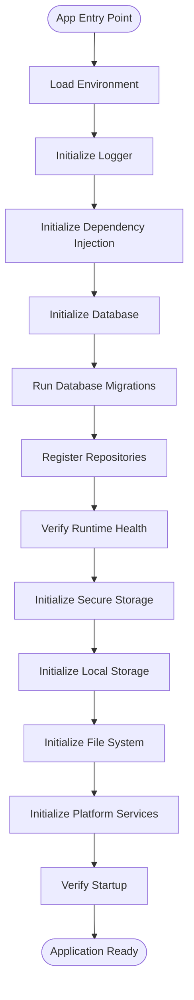

# Application Startup & Runtime Lifecycle Architecture

This document describes the application initialization pipeline, runtime context lifecycle, and health verification strategies inside the Vaha mobile companion application.

---

## 1. Startup Lifecycle Overview

Vaha implements a highly structured, sequential, and step-isolated **Application Bootstrap Pipeline**. When the application starts, it runs a series of initialization procedures before displaying the primary user interface. 

This ensures all system-level dependencies (logger, configuration, database connection, database schemas/migrations, platform services, and repository layers) are fully prepared and operational. If any step fails, the pipeline halts immediately, logging the failure details and putting the application into a stable error state rather than crashing silently.



---

## 2. Initialization Order & Flow

The following sequence lists the bootstrap steps executed by the `BootstrapManager`:

1.  **Load Environment:** Verifies that environment configurations and credentials are loaded successfully.
2.  **Initialize Logger:** Instantiates and registers the centralized `ConsoleLogger` in the Dependency Injection container.
3.  **Initialize Dependency Injection:** Pre-registers static configurations (`AppConfig`) inside the DI container.
4.  **Initialize Database:** Configures the native SQLite database and enables WAL (Write-Ahead Logging) mode.
5.  **Run Database Migrations:** Performs database scheme updates via Drizzle migrations.
6.  **Register Repositories:** Scans and registers all database data-access layers as singleton providers.
7.  **Verify Runtime Health:** Audits system setup (confirming environment, config, logger, database, and repository connections are healthy).
8.  **Initialize Secure Storage:** Verifies connection to the local secure credential vaults.
9.  **Initialize Local Storage:** Verifies local key-value storage availability (`react-native-mmkv`).
10. **Initialize File System:** Validates local directories for audio and content files.
11. **Initialize Platform Services:** Initializes system notification layers and platform lifecycle listeners.
12. **Verify Startup:** Final validation stage indicating the system is ready to render UI.

---

## 3. Runtime Responsibilities

### BootstrapManager
The bootstrap orchestrator is responsible for:
*   Sequential execution of registered startup steps.
*   Measuring step durations and logging startup metrics.
*   Catching and wrapping exceptions inside Result monads to prevent uncaught runtime loops.
*   Returning a structured `BootstrapResult` summarizing the operation.

### RuntimeState
Tracks general application metrics outside of the UI feature state (does NOT use Zustand):
*   **App Status:** `Initializing` | `Ready` | `Failed` | `Shutting Down`.
*   **Startup Duration:** Time in milliseconds to complete bootstrap.
*   **Current Step:** Name of the currently executing startup step.
*   **Last Error:** Wrapped `AppError` instance if initialization fails.

### AppLifecycle
Listens to native OS state changes (e.g. background/foreground transitions) and logs these transitions, enabling hooks for resource cleaning or background synchronization.

---

## 4. Health Checks

Before completing startup, `StartupHealth` runs a diagnostics suite checking:
*   **Environment Check:** Verifies configuration objects are resolved.
*   **Logger check:** Verifies logging system resolves.
*   **Database check:** Runs quick SQLite connectivity checks (`SELECT 1;`).
*   **Repository registration:** Verifies all 6 repositories resolve successfully via DI.

Any failure in these checks flags the health state as `Critical`, preventing the app from launching.

---

## 5. Future Extension Points

The `BootstrapManager` allows plugins to register custom startup steps before bootstrap is executed:
```typescript
const bootstrap = ApplicationBootstrap.getInstance();
const manager = bootstrap.getManager();

// Future plugin step
manager.register(new BLEInitialisationStep());
```
This enables features like Bluetooth, synchronization modules, or AI pipeline steps to hook cleanly into the boot pipeline without altering the core bootstrapping orchestration.
