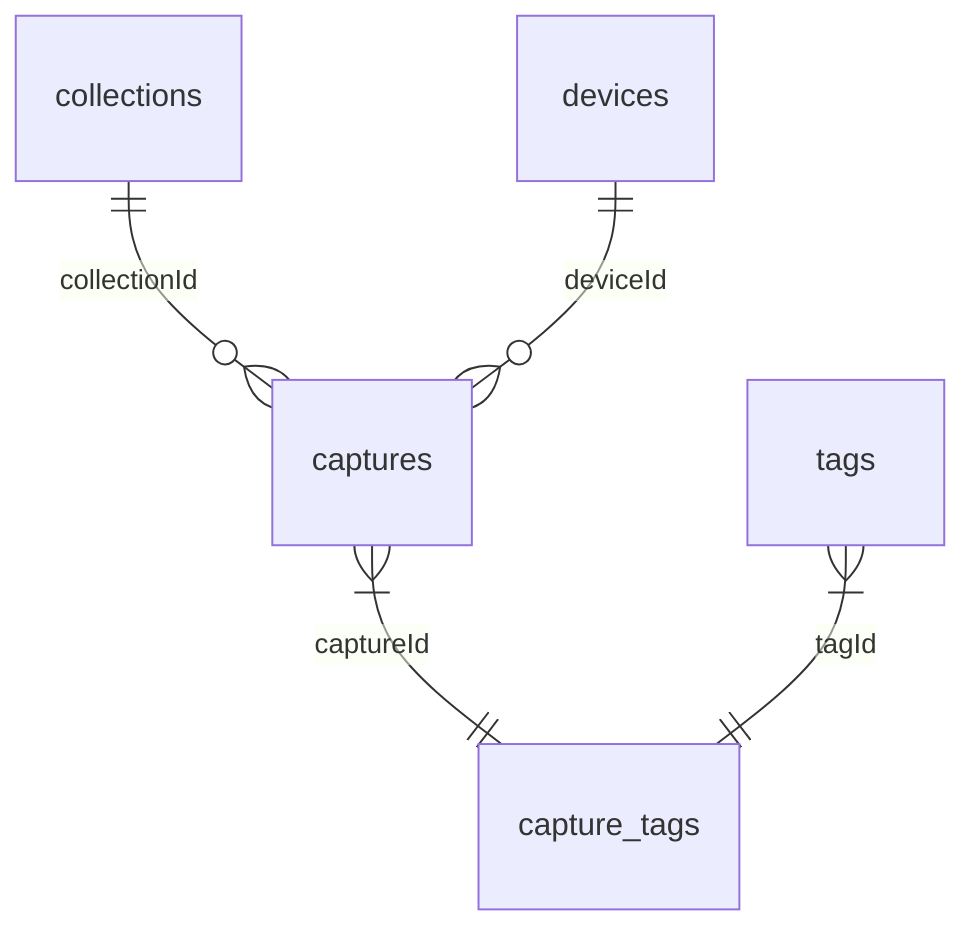

# Database Architecture & Migrations

This document specifies the database layer architecture, table relationships, index optimizations, and migrations workflow for Vaha.

---

## 1. Database Layer Tech Stack
*   **Expo SQLite:** Native on-device SQLite database client.
*   **Drizzle ORM:** TypeScript-first ORM providing type-safety for queries.
*   **WAL (Write-Ahead Logging):** Enabled on connection startup (`PRAGMA journal_mode = WAL;`) to optimize concurrent read/write operations.

---

## 2. Table Relationships

*   **`captures`**: Links optionally to a parent `collection` and the pairing `device` that recorded the thought.
*   **`capture_tags`**: N-to-N junction table linking `captures` and `tags` cleanly.
*   **`sync_queue`**: Decoupled queue tracking local mutations (inserts, updates, deletes) to be processed by sync handlers.

---

## 3. Query Index Strategy
Indexes are placed on columns frequently queried to feed the timeline views:
*   `captures(created_at)` and `captures(updated_at)` (for chronology).
*   `captures(collection_id)` (for folder filtering).
*   `captures(device_id)` (for hardware provenance filtering).
*   `captures(sync_state)` (for syncing filters).
*   `capture_tags(capture_id)` and `capture_tags(tag_id)` (for fast tag scans).

---

## 4. Migrations Workflow
*   **Generation:** Run `npx drizzle-kit generate` inside `app/mobile` to produce SQL diffs.
*   **Execution:** Migrations are bundled inside `src/infrastructure/database/migrations/` and run automatically on application startup via `DatabaseProvider.runMigrations()`.
*   **Upgrades:** Never manually delete `vaha_journal.db` in production; schema modifications must flow through migrations to preserve local user data.
